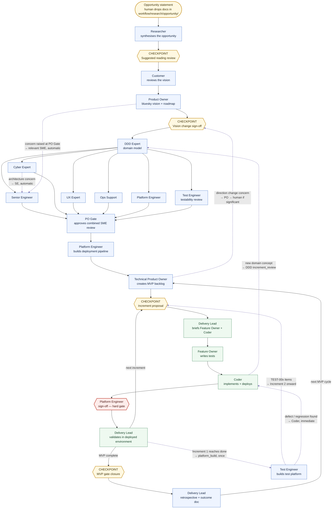

# How to run this workflow

This is a guide for the human using this workflow — not for the agents (they
read `AGENTS.md`). It explains how an engagement starts, how work moves
between agents, and the points where you'll actually be asked to weigh in.

## Starting point: an opportunity statement

Everything begins with you dropping one or more documents into
`workflow/research/opportunity/` — a problem statement, a rough idea, market
notes, whatever you have. It doesn't need to be polished. Then invoke the
Researcher:

```
@researcher
```

From here, the workflow runs itself. Each agent finishes its piece, writes
its output into `workflow/`, and hands off directly to the next agent. You
don't drive each step — you'll hear from the workflow again at the next
checkpoint, or sooner if something needs your input.

## Workflow diagram



**Legend:** amber hexagons are the four human checkpoints · red hexagon is the
one automated hard gate (PE sign-off) · blue boxes are single agent steps ·
green boxes are the per-increment loop, which repeats until the MVP is done ·
dashed purple arrows are feedback loops — understanding routing backward,
mostly automatic, only surfacing to you where noted. The ones shown are
representative, not exhaustive — see "Feedback loops" below.

This renders automatically wherever GitHub displays the file. If your viewer
doesn't render Mermaid, the same information is in the phase table and
checkpoint list below.

## The phases, at a glance

| Phase | Who's involved | Produces |
|---|---|---|
| 1. Research | Researcher | Synthesised opportunity write-up, suggested reading list |
| 2. Vision | Customer, Product Owner | Vision review, "bluesky" vision doc, roadmap |
| 3. Domain modelling | DDD Expert | Ubiquitous language, bounded contexts, draft schemas |
| 4. SME review | Senior Engineer, Cyber, UX, Ops, Platform Engineer, Test Engineer | Parallel review notes against the domain model |
| 5. PO Gate | Product Owner | Sign-off on the combined SME feedback |
| 6. Pipeline & backlog | Platform Engineer, Technical Product Owner | Deployment pipeline, MVP 1 backlog |
| 7. Increment loop | Delivery Lead, Feature Owner, Coder, Platform Engineer | Built, tested, deployed, signed-off, validated increments — repeats per increment |
| 7b. Test platform build | Test Engineer | Once, right after Increment 1 is `done` — test framework, coverage reporting, defect log, built from what Increment 1 actually needed |
| 8. MVP Gate | Delivery Lead, Customer | Confirmation the MVP delivers real value |
| 9. Retrospective | Delivery Lead | Outcome document — lessons that change how the *next* MVP runs |

After the retrospective, the cycle begins again from step 6 for the next MVP,
using what was learned. Phase 7b happens once, not every MVP — from then on,
Test Engineer only returns for `enhancement` when a real gap shows up.

## Agent hand-offs

Agents can't sit idle waiting for you to relay messages between them. Each
one ends its turn with a short **HANDOFF** note (who's next, what they should
read, what their first action is) and then dispatches directly to that agent.
This happens automatically, without you in the loop — that's the whole point
of the workflow. Your job is to respond at checkpoints, not to shuttle
outputs between agents.

## Feedback loops — this isn't strictly linear

The phase table above shows the forward path, but understanding doesn't only
flow that direction. As implementation surfaces things nobody knew at the
start, the process routes that new understanding back to whichever agent
owns it — automatically, without waiting for you, except where the change is
significant enough to need your input.

A few examples:

- **A ticket introduces a new domain concept.** The Coder or Feature Owner
  surfaces it, the Technical Product Owner invokes the DDD Expert in
  `increment_review` mode, and the domain model (`workflow/techsme/ddd.md`)
  is updated before the ticket can reach `code-complete`.
- **An SME review raises an architectural concern.** Cyber, UX, Ops, or Test
  Engineer feedback routes straight back to the Senior Engineer, who may
  revise the architecture before SME summaries are finalised.
- **The Product Owner has a concern during PO Gate.** It routes back to
  the relevant SME automatically — only a genuine vision change goes to you.
- **The backlog needs to change direction.** The Technical Product Owner
  raises it with the Product Owner, who escalates to you only if it's a real
  change in direction, not routine reprioritisation.
- **A test reveals a defect or regression.** The Test Engineer logs it and
  notifies whoever owns the fix — immediately if it's a regression, not
  batched for the next retrospective.

The workflow skill has the full table of these loops — who triggers them,
who they go to, and whether a human needs to be involved. Most are fully
automatic; only genuine vision changes and increment deferrals stop and
wait for you.

## The four human checkpoints

Everywhere else, the workflow keeps moving on its own. These are the only
points it deliberately stops and waits for you:

1. **Suggested reading review** — after the Researcher's first pass. It
   presents what it found; you can add anything it missed before it proceeds.
2. **Vision change sign-off** — only the Product Owner can commit to a
   change in direction, and only with your explicit go-ahead.
3. **Increment proposal** — before each increment is built, the Technical
   Product Owner or Delivery Lead presents the scope and waits for your
   approval to start.
4. **MVP gate closure** — once an MVP is deployed and validated, the
   Delivery Lead brings it to you and the Customer for review before the
   next MVP cycle is defined.

If you don't hear from the workflow, it's still working — it'll surface when
it reaches one of these four points.

## The increment lifecycle

Every increment moves through the same states, and one gate is non-negotiable:

```
open → proposed → human-approved → in-progress → code-complete
     → deployed → pe-signed-off → validated → done
```

An increment cannot be marked `validated` until the Platform Engineer has
independently signed off the deployment. This holds even under time
pressure — a deployment that "seems fine" is not the same as one that's
been checked.

## Quality practices running underneath all of this

- **Grill-me** — agents interrogate their own assumptions before acting,
  especially right before a checkpoint. This is where most ambiguity gets
  caught before it becomes wasted work.
- **Memory** — every agent keeps a running memory file, so decisions and
  lessons from earlier in the engagement aren't relearned or contradicted
  later.
- **Ubiquitous language** — once the domain model exists, every agent uses
  the same vocabulary for the same concepts. A synonym for a domain term is
  treated as a defect, not a style choice.
- **Retrospective** — every MVP closes with an outcome document that
  changes how the next MVP is run, not just a record of what happened.
- **Defect and regression tracking** — from Increment 1 onward, genuine
  defects (not just incomplete features) get logged in
  `workflow/quality/defects.md` by the Test Engineer, with the responsible
  agent notified. Regressions — something that used to work and now
  doesn't — are flagged immediately, not left for the retrospective to catch.

## Changing your mind mid-flight

You can redirect the workflow at any point. The expected response from every
agent is to understand what changed and adapt the plan — not to push back or
treat the existing backlog as a constraint. The backlog exists to serve what
you're trying to achieve; it's a hypothesis, not a contract.

## Where things end up

Everything the workflow produces lives under `workflow/`, organised by
phase — research, product vision, domain/SME output, requirements and
increments, agent memories and reviews, and retrospectives. See the root
`README.md` for the exact layout and how it maps to the agents and skills
that produce it.
